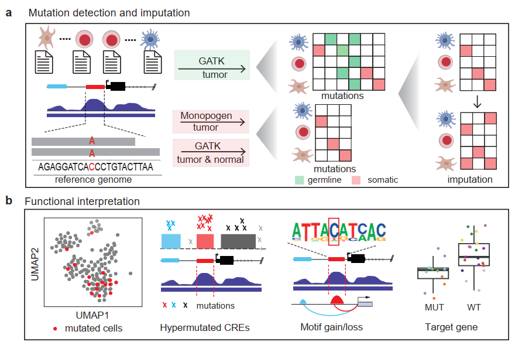

# eMut
## **Introduction**
The eMut, an integrated pipeline for detecting, imputing, and characterizing non-coding mutations in CREs with functional consequences at the single-cell level. 

### Workflow:

Briefly, eMut consists of two main modules: mutation detection and functional interpretation.
Step1. Mutation detection: eMut detects mutations in each cell by implementing methods such as Monopogen or GATK by single-cell chromatin accessibility data. 
Step2. Mutation imputation (optional): Given the sparse of scATAC-seq data, we further imputed candidate mutated cells by network propagation using mutated cells (seed cells) in cell-cell similarity graph. 
Step3. Functional interpretation: 
1) recognize cell type-specific or lineage-specific mutations;
2) identify hypermutated CREs with significant excess of mutations to characterize potentially important enhancers;
3) predict the effects of mutations on transcription factor motifs (loss or gain);
4) compare target gene expression changes between mutated cells (or samples) and wild-type. 

